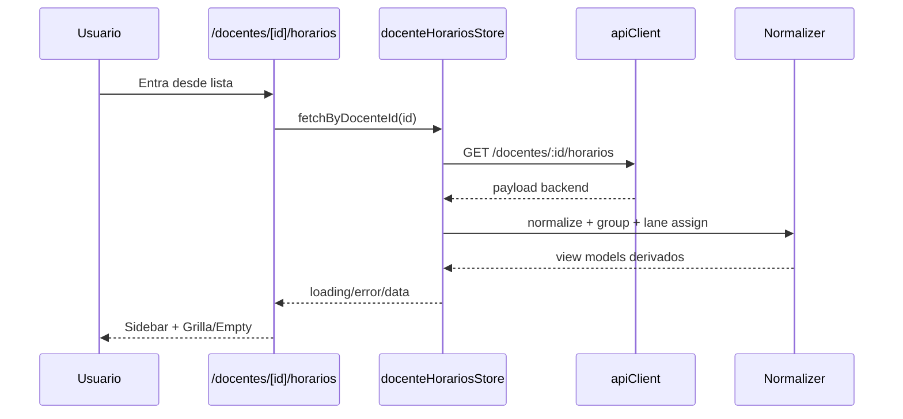

# Design: Vista Horario Docente

## Technical Approach

Implementar una página cliente protegida en `/docentes/[id]/horarios` que consume `/docentes/:id/horarios`, normaliza datos en `application`, y renderiza UI read-only en dos zonas: sidebar (período + cards por grupo) y grilla semanal (Lun-Sáb). Se mantiene patrón actual del proyecto: App Router + Zustand + componentes locales de feature + primitives `components/ui`.

## Architecture Decisions

### Decision: Estado y composición

| Option | Tradeoff | Decision |
|---|---|---|
| Estado local en `page.tsx` | Rápido, pero acopla fetch+normalización+UI | ❌ |
| Store dedicado `docenteHorariosStore` | Más archivos, pero separa responsabilidades y facilita evolución | ✅ |

**Choice**: Store dedicado + selector de derivados (grilla/lanes).  
**Rationale**: Sigue convención existente (`docentesStore`) y evita lógica compleja dentro de componentes visuales.

### Decision: Manejo de solapamientos

| Option | Tradeoff | Decision |
|---|---|---|
| Apilar vertical dentro del bloque | Rompe percepción temporal exacta | ❌ |
| Filtrar por grupo activo | Oculta información cuando hay conflictos reales | ❌ |
| Lanes en paralelo (split horizontal) | Más cálculo, máxima fidelidad temporal | ✅ |

**Choice**: Lane assignment por día con ancho dinámico por cluster.  
**Rationale**: Permite ver todos los bloques simultáneos en el mismo rango horario sin perder duración.

### Decision: Rango temporal de grilla

| Option | Tradeoff | Decision |
|---|---|---|
| Fijo (ej. 07:00–22:00) | Puede cortar bloques reales | ❌ |
| Dinámico min/max de horarios normalizados | Varía por docente, pero muestra fin real | ✅ |

**Choice**: `gridStartMin = min(startMin)`, `gridEndMin = max(endMin)`.  
**Rationale**: Cumple requerimiento de visibilidad clara de hora fin.

## Data Flow

`page.tsx` → `useDocenteHorariosStore.fetchByDocenteId(id)` → `api.getDocenteHorariosById` → `normalizeDocenteHorarios` → derivados (`period`, `timeRange`, `rows`, `lanes`) → Sidebar + WeeklyGrid.



## File Changes

| File | Action | Description |
|---|---|---|
| `app/docentes/[id]/horarios/page.tsx` | Create | Ruta protegida, layout, header, botón `Volver` a `/docentes`. |
| `features/scheduling/docentes/application/api.ts` | Modify | Agregar `getDocenteHorariosById(id)`. |
| `features/scheduling/docentes/domain/types.ts` | Modify | Tipos API response + view models de horario/grupo/lane. |
| `features/scheduling/docentes/application/docenteHorariosStore.ts` | Create | Estado de carga/error/período y derivados de grilla. |
| `features/scheduling/docentes/application/normalizers.ts` | Create | Pipeline: parse tiempos, fallbacks, GCD, rango dinámico, lanes. |
| `features/scheduling/docentes/ui/TeacherSchedulePage.tsx` | Create | Composición responsive sidebar + main. |
| `features/scheduling/docentes/ui/GroupSummaryCard.tsx` | Create | Card por grupo (incluye estado `Sin Horarios`). |
| `features/scheduling/docentes/ui/WeeklyScheduleGrid.tsx` | Create | Grilla Lun-Sáb con rows dinámicas y bloques por lane. |
| `features/scheduling/docentes/ui/ScheduleBlock.tsx` | Create | Bloque visual con fallbacks de ambiente/tipo/fechas. |
| `features/scheduling/docentes/ui/DocentesTable.tsx` | Modify | Acción `CalendarClock` navega a `/docentes/{id}/horarios`. |

## Interfaces / Contracts

```ts
type NormalizedSchedule = {
  scheduleId: string
  groupKey: string
  day: 1|2|3|4|5|6
  startMin: number
  endMin: number
  durationMin: number
  materia: string
  grupo: string
  carreras: string[]
  ambienteLabel: string // fallback: Sin ambiente
  tipoLabel: string // fallback: No especificado
  fechasLabel: string // fallback: Fechas no definidas
}

type GroupSummary = {
  groupKey: string
  materia: string
  grupo: string
  carrerasLabel: string
  countHorarios: number
  estado: "Activo" | "Sin Horarios"
  colorIndex: number
}
```

Algoritmos clave:
- **GCD default**: tomar `durationMin > 0`; `period = gcd(list)`; si vacío/NaN => `90`.
- **Rango dinámico**: `minStart = min(startMin)`, `maxEnd = max(endMin)`; si sin horarios usar `8:00-18:00` solo para skeleton (grilla final oculta por empty state).
- **Rows**: desde `minStart` hasta `maxEnd` en pasos `period`, generando labels `HH:mm`.
- **Overlaps (lanes)**: por día, ordenar por `startMin`; asignar primer lane libre (end <= next.start); guardar `laneIndex` y `laneCount` por cluster para `left/width` CSS porcentual.

## Styling & Responsive Strategy

- Solo tokens de tema: `bg-card`, `bg-muted`, `text-foreground`, `border-border`, `bg-primary/secondary/accent/muted` con opacidades para color por grupo.
- Paridad de color: `groupKey -> colorIndex` estable; card y bloques reutilizan mismo índice.
- Mobile-first: `flex-col`; en `lg` sidebar fija (`lg:w-80`) + grilla flexible.
- Grilla con scroll horizontal en pantallas chicas (`overflow-x-auto`) y altura acotada con scroll vertical.

## Error / Empty / Loading / Navigation

- **Loading**: skeleton de cards y grilla.
- **Error**: panel con mensaje + botón reintentar.
- **Empty global** (sin horarios normalizados): ocultar grilla y mostrar estado vacío.
- **Grupo sin horarios**: card visible con `estado = Sin Horarios`, `countHorarios = 0`, sin bloques.
- **Volver**: botón explícito `router.push("/docentes")`.

## Testing Strategy

| Layer | What to Test | Approach |
|---|---|---|
| Unit | `gcdDurations`, `deriveTimeRange`, `buildRows`, `assignLanes` | Tests puros en `normalizers.ts` (cuando se habilite infraestructura). |
| Integration | Store fetch + derivados + estados | Mock `apiClient.get` y validar transiciones de estado. |
| E2E/manual | Navegación, empty/error, overlaps visibles | Flujo `/docentes` → horario → volver. |

## Migration / Rollout

No migration required. Rollout incremental: primero wiring de navegación, luego vista horario.

## Open Questions

- [ ] Confirmar shape exacto del payload para grupos sin horarios (si llega anidado o separado).
- [ ] Definir prioridad visual cuando `laneCount` alto (>4): truncado de texto vs tooltip.
